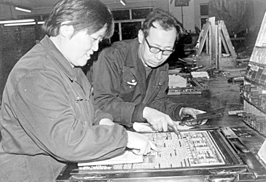
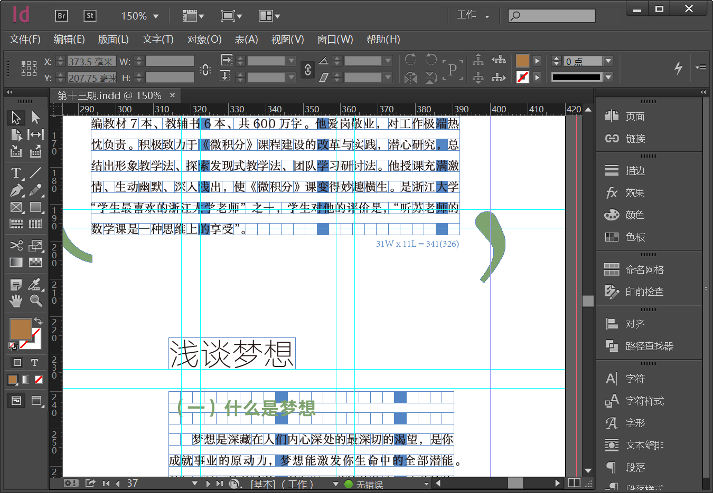
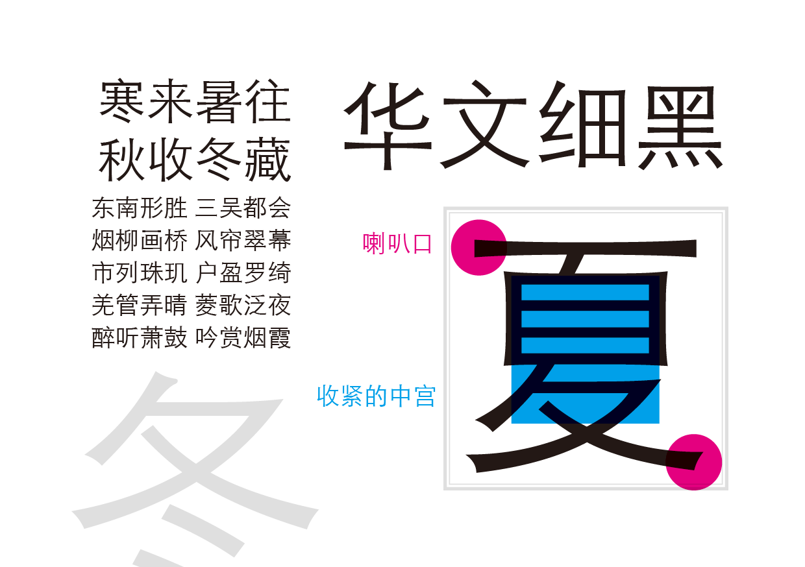
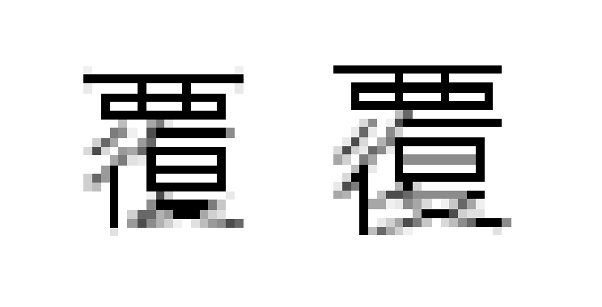
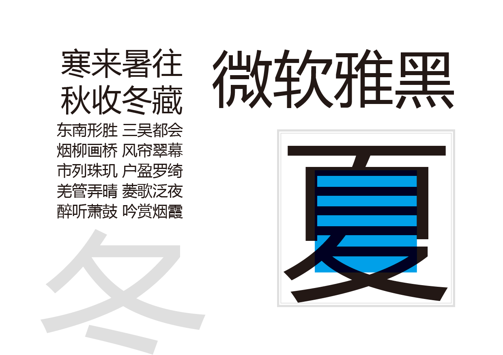
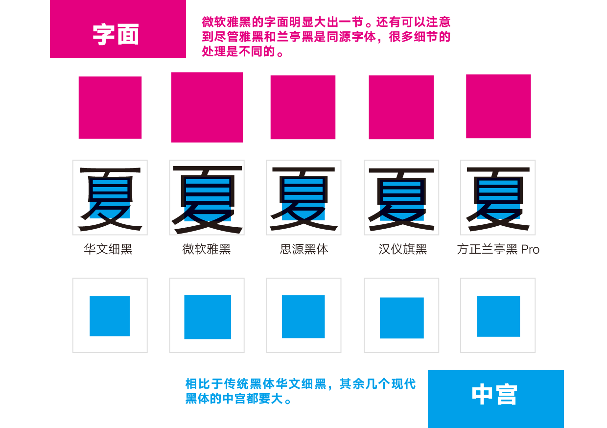
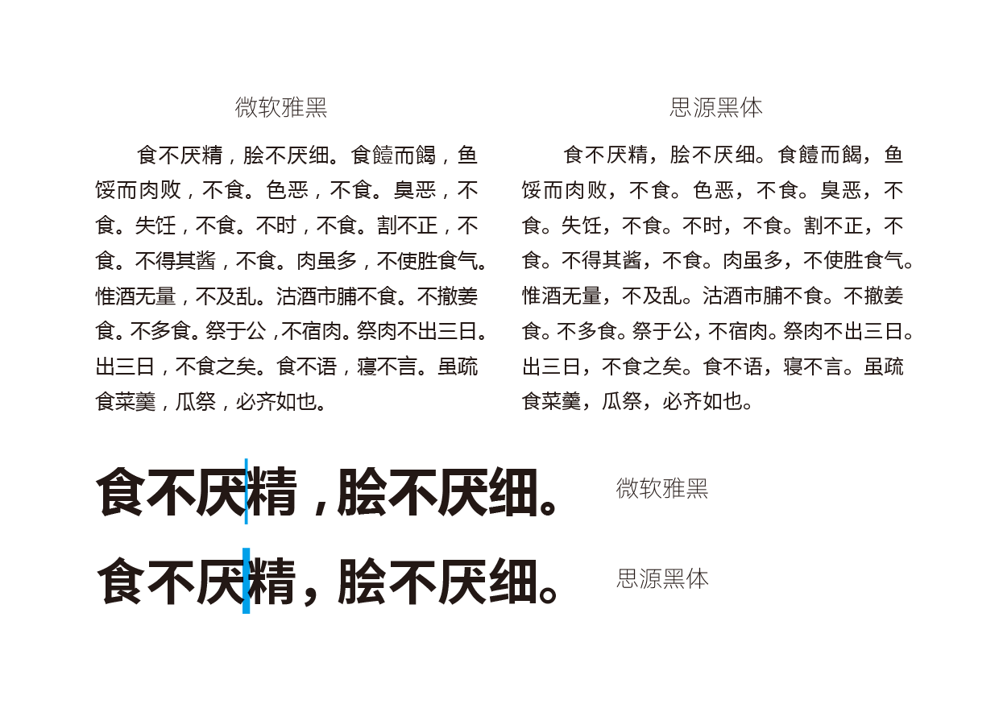
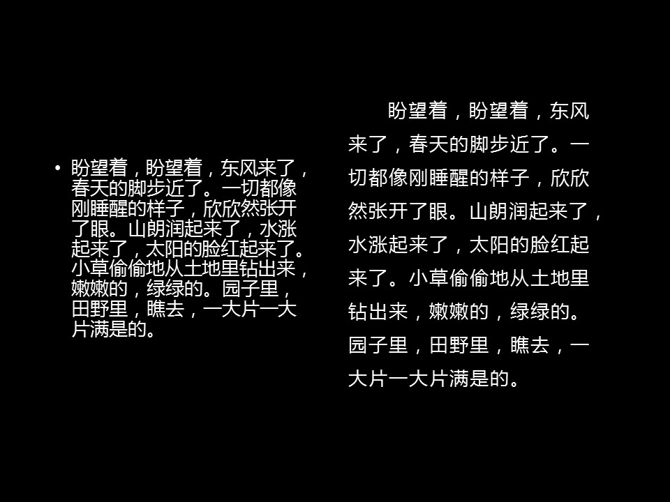
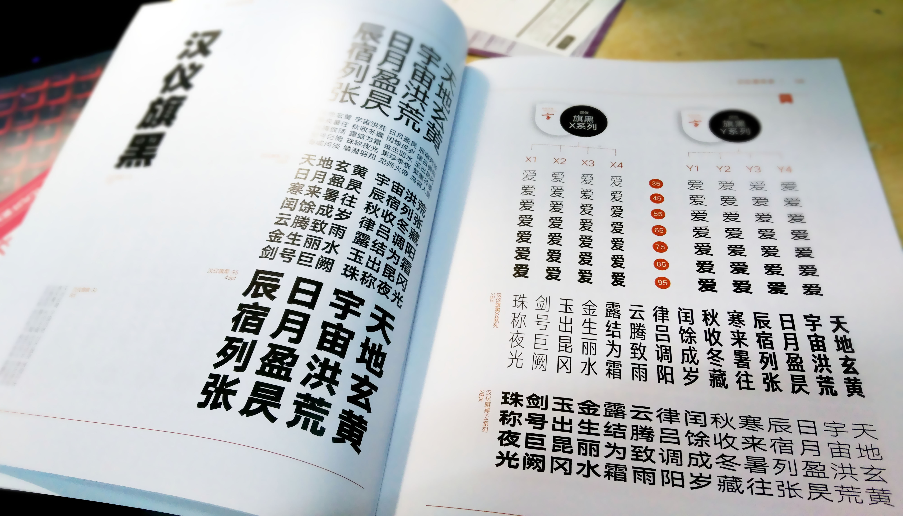

# 微软雅黑：变革、妥协与遗憾

> 作者：[Celestial Phineas](http://celestialphineas.github.io)，
> 本文原载于“浙大竺院人”微信公众号。

## 引言

微软雅黑这款字体融入中国人的生活已经有十年之久。它似乎有一种神奇的魔力，吸引了如此之多的粉丝。当你问起某人最喜欢的字体，有相当大的可能你会得到“微软雅黑”这一答案。然而作为《竺院人》杂志的美术编辑，我不会建议我的任何一位同事在杂志中使用这款字体。如果你能够耐心读完这篇文章，相信你会对小编的考虑有所理解。可是如果读到一半就发觉索然无味（你们真的这么好意思抛弃我们这些萌萌哒的小编吗QAQ，收藏一下或是点个赞也好啊~），也请稍稍向后滚一滚屏幕，美小编会以杂志工作带来的对文字的理解，帮助你更好地处理PPT中的微软雅黑。

后面的故事，你我亲历，却未尝留意。

## “告别铅与火，迎接光与电”

> 上世纪80年代，报社的拼版工人在检查版面。

> 《竺院人》杂志的排版。现在的排版者，已经不再亲手触碰文字的物理实体了。

一切都似乎来得太突然。

印刷厂里面，排字工人还在仔仔细细地捡着铅字，冰冷的金属微微浸染了些双手的温度。[^a]思想在这些新诞生的组合之间积聚，等待着油墨。它们将要向世人发出呼告，号召更多的思想，加入到关于真理的大讨论中。

印刷厂里那些灵巧的双手大概不知道，在千里之外的北京，第一张激光照排输出的中文报纸底片安静地躺着…… [^b]

汉字的光与电时代就此开始。

## 变革·诞生

转眼到了新世纪。刚刚发布的Windows XP惊艳四座，微软在酝酿着下一个变革。下一代操作系统应该更安全、功能更强大、用户界面更加友好、视觉效果更加出色。微软在接下来五年的积淀之中，为了改变屏幕上锐利且不堪阅读的中易宋体点阵，微软委托方正公司——这家因为“当代毕昇”王选院士而诞生的北大校办企业，设计一款全新的中文系统字体。这款字体应该容易阅读，在小字下依旧清晰，友好且富有现代感……

优秀的屏幕显示字体应该少一些细节，以保证文字缩小之后这些细节不会占用额外的像素而使文字变得难以阅读。这个观念在今天看来似乎十分浅显，可是在十多年前，这是一个相当大的挑战。

汉字中缺少细节的字体类型莫过于黑体，字形方正、横平竖直、笔画宽度几乎相等……似乎是再完美不过的选择。可是当时几乎所有的黑体都是上世纪铅字的复刻，这些字的笔画末端都加上了“喇叭口”，这样设计是一种向技术的妥协。铅字笔画末端的油墨容易晕染，如果去掉这些“喇叭口”，一旦印出来，字的笔画两端会变成圆形，从而显得没有精神。而“喇叭口”的存在解决了这个问题。黑体字的排印效果因为这些锐利的边角变得挺括。老一辈的字体设计师们凭借着这样的设计，更新了新中国书刊的面貌。思想在这样“精神”、“气派”的文字间传播，挺拔的字体与向上的社会相互影响作用…… [^c]

> 华文细黑，典型的传统黑体

可就是这样的成功设计，在新的时代遇到了危机。“传统黑体”曾经的优点成为了硬伤。喇叭口在低分辨率的屏幕上变成了难看的尖角。黑体的革新一触即发。

> 相同字号的华文细黑（传统黑体）和微软雅黑（现代黑体）屏幕显示效果对比，传统黑体由于笔画末端的喇叭口，显示效果很不干净，而微软雅黑避免了这个问题。

早在上个世纪90年代，上海印刷研究所的字体设计师们就已经在尝试设计崭新的黑体了。国宝级的字体设计师徐学成[^d]，在他的著作《美术字技法与应用》中的黑体一节就引入了这种无喇叭口的崭新设计。齐立先生[^e]则在90年代初就开始试作这种崭新的黑体，这就是十年之后的微软雅黑。

> 《美术字技法与应用》中的现代黑体，与微软雅黑十分相似

当方正接受了微软的委托之时，齐立已经从上海来到了北京。彼时已经成为方正字库高级字体设计师的他，毫无疑问地担起了微软雅黑总设计师的重担。试作开始向实作转变。中国黑体的革新、现代黑体的革命即将发生。

## 谈雅黑的设计

> 微软雅黑，可以注意到相比华文细黑明显放大的中宫

雅黑的设计，其终极目标，无外乎充分利用屏幕像素，使文字在缩小之后依旧清晰可读。

中国的字体设计事业，自中华人民共和国成立至本世纪初，经过五十多年的发展，孕育了一套属于自己的成熟理论。改革开放又给这一事业带来了来自其他文化熏染，以及来自其他学科的理论影响。可就是在这已经趋于成熟的汉字印刷体审美、在这已经成熟了的设计理论下，一个突破传统的搅局者出现了。这或许也是时代变革的必然。

微软雅黑一反汉字清秀俊朗的审美，

**放大字面**（字面即文字本身占据字身框的大小，打比方地说，排版工作就像在作文纸上写字，排版大字面的字就好比每个格子都写得很满），

**夸大中宫**（中宫是书法概念，对于印刷字体，中宫大的字间架结构宽松，中宫小的字间架结构向内收紧。传统汉字书法多以中宫收紧为美），

**压低重心**（汉字的重心越高文字越显清秀，但是低重心的字有助于横排阅读）。

> 几款黑体之间的对比

这些特点看似反常，可我们最终发现齐立先生是对的。2006年，Windows Vista发布，丧心病狂的安全策略和糟糕的兼容性使其遭到唾骂与嘲笑。可是随之一起发布的系统字体，微软雅黑，却给每个看过Vista华丽界面的人留下了深刻印象。即便是小字，它也是那么清晰、友好、让人耳目一新。

##打破妥协，却陷入另一泥淖？

微软雅黑破除了喇叭口这一向铅字排印和照相排版技术妥协的产物。可现如今，当我们跳出了微软雅黑的时代，再回过头来审视它时，我们发现它陷入了另一个向技术的妥协。
新的泥淖正是屏幕显示技术。

十年之前，大家的电脑显示器屏幕分辨率还不够高，屏幕上的文字，实在是缺乏足够的像素去使之清晰。微软雅黑的大字面爽了一时。追求屏幕像素充分利用的大中宫、大字面，使它抛弃了人文气息，相比于传统黑体，雅黑显得肥大与生硬，缺少了一种手写的温暖感。这些缺点，当屏幕分辨率得到提升，便暴露无遗。

超大字面使阅读者的感受局促不安——密密麻麻、毫无间距的文字从眼前流过，再清晰也会让人疲劳。

> 微软雅黑排版的局促感。版面太紧，让人读起来很累。（蓝色标记为字间距）

雅黑是为屏幕显示而生的。屏幕为它提供了来到世界的机遇，却也将其禁锢。印刷出来的微软雅黑，挤作一团，显得丑陋不堪。[^f]

## 为什么用雅黑？

不得不说，微软雅黑开启了一个时代，即便它不是严格意义上的现代黑体开山之作。它的影响，是任何一款字体无法匹敌的。我们也不得不说，雅黑是优秀的，尽管在今天看来，它有那么多的不堪。

我们为什么使用雅黑？

微软已经将雅黑渗透到了各个角落。在大多数计算机上，这款字体都会被安装——甚至是苹果电脑，只要你安装了微软的Office！这保证了雅黑作为演示用字的良好兼容性。而有这般普及程度的字体，又能胜任幻灯片中的文字展示，怕是除了雅黑也很难说出来第二个吧。

如果你对自己PPT的整体效果不满意，却说不出原因，不妨从排版细节入手找找原因。

大多数人做PPT时，大概会把文字排成左边的模样，这也是PowerPoint的默认样式。可是你有没有觉得文字十分局促、特别容易看错行呢？间距给人以美感。文字之间的间距会让读者觉得更加舒适。

> 微软雅黑在幻灯片中的排版优化

为了弥补微软雅黑排版的缺陷，笔者有意拉大了字与字之间的间距，以弥补雅黑大字面产生局促感的缺陷。在Word和PowerPoint中，修改字间距可以通过选中文字→右键→字体，在字体对话框中找到“高级”或“字符间距”选项卡，然后根据对话框中的信息，对字符间距做出调整。

除了字间距之外，笔者还将行距拉大至1.5倍行距，以规避读者看错行的风险。其他细节还包括首行缩进两字符，以使排版内容看起来像文段。

## 遗憾、现状与未来

雅黑是遗憾的。十年风雨后的今天，经过若干次的版本更新，版本号已经达到6.22的雅黑问题依旧。它就像一个已经坠地的孩子，成长归成长，可一些与生俱来的东西是再也无法改变的了。中宫与字面已经不再有改进的机会，笔形、结构、布白更是牢牢地固定在了那里。

后来，方正发布了完整的“微软雅黑”——方正兰亭黑系列，相比于用于屏显的雅黑，兰亭黑的字面微微缩小了些。在设计师之间，兰亭黑一度成为最热的字体——它多字重的设计为各种应用场合提供了合适的选择，现代感极强的设计风格也让它广泛地受到人们喜爱。这种热度以及字体本身的实用性也令更多的厂商开始考虑设计现代黑体，其遗憾也在更多新字体中被弥补。

2014年，方正发布了悠黑系列，一款更适合于正文阅读、人文气息大大增强了的黑体，近乎疯狂的字面和中宫已然不再。

同年，Adobe和Google发布了具有划时代意义的开源字体——思源黑体，成为了此后安卓系统的默认字体。

微软雅黑和方正兰亭黑的设计师，齐立先生也深知遗憾。也是在2014年，又一款由齐立先生设计的黑体系列——汉仪旗黑发布。

> 汉仪旗黑字体样张

2015年，苹方系列发布。苹果终于将系统界面上不适合屏幕显示的传统黑体（华文黑体）换成了现代黑体。[^g]

2016年，小米与方正合作，在兰亭黑的基础上制作了小米手机的系统字体——“小米兰亭”。同年，方正发布了“方正兰亭pro”，进一步缩小了兰亭黑的字面，并在细节加以完善。遗憾在逐渐收敛。

…………

从微软雅黑开始，现代黑体真正走进人们的生活已经有了十年。这十年中，人们的视觉不断被新字体刷新，人们的审美也因为这些字和这些字带来的设计，不断地提升着。正如齐立先生所说：“文字既是文明传承的载体，又代表了人民的审美观，他不是沉默的东西，也蕴含着感情。”设计看似冰冷的现代黑体，每个字都是融入了设计师双手的温度的。字库从来不是什么电脑自动生成的，每一款字的背后都是一次攀登，都是彻夜不眠的思考、是散落满地的字稿。

很多人不解齐立为什么设计了兰亭黑，却还要做一款一模一样的旗黑。作为《竺院人》杂志的小编，齐立先生的心情，我想我们总归是能窥见一点的吧。每次拿到新印出来的杂志，欣喜若狂之后，细细品读就会有一种莫名的失落感——还是有校对疏忽，还是有的版面细节处理不当，也还是有种种自己不满意的地方……这就像是单调有界的数列永远跑不到它收敛的地方。完美是不存在的，但是攀登还是要继续。

中文字体设计已经进入到了一个追求创新的新时期，时代和社会等待着下一款优秀的字体来刷新的人们的眼界、来刷新中国的设计。传统与变革的交融，人文与技术的碰撞，即刻发生。

## 后记

不知道会有多少人看到这里。

小编的时间仓促，水平也十分有限，想必文章当中会有很多错误，还请读者原谅和指出。在写作过程中，我已经在尽力让文字浅显并保证实用性，毕竟这篇文章的受众是对字体感兴趣但是了解不多、又有相关需要的普通人。过长的篇幅或许显得废话很多与条理不清，并不活泼的语言风格也可能会打消读者看完的欲望。小编要感谢能看到这里的读者。

刚刚进入到《竺院人》杂志工作室的时候，作为美小编的我只对字体有比较基础的理解，并也曾经讨厌过系统自带的宋体、曾经是微软雅黑粉。随着对工作的理解加深，我越来越关注文字本身，也终于了解到自己曾经的无知。或许把去年一年的《竺院人》美编工作称作“练手”会让人发指，但是我的那份工作对我来说，就是一次次的试错与攀登。由此，我也大致理解了字体设计人的那份执着。

我愈加深刻地领悟到，不懂字就做不好排版。在人人都是排字工的今天，小编真诚地希望这篇文章会对你的论文排版和presentation有所帮助与启发。

### 雅黑之最

1. 第一款支持微软ClearType技术的中文字体。
2. Windows系统上第一款拥有真正粗体的简体中文系统字体。微软雅黑常规体和微软雅黑粗是两个字体文件。粗体的雅黑并不是常规体雅黑生成的，而是另做的。（希望这样解释可以尽可能浅显，但是严格意义上说，这种说法并不好。）
3. 简体中文字体中，第一款用于操作系统界面的现代黑体。
4. 微软雅黑（方正兰亭黑）也是方正公司第一款黑体系列，最终破天荒地发布了从超细黑到特黑，包括长体和扁体，共14款字体。这种家族化设计在当时的中国尚属罕见，而这种设计观念在西方已经十分成熟。

### 微软雅黑的bug与设计问题

1. 雅黑的配套标点十分糟糕，左右引号区分度极低，省略号设计成了居下（中文排版习惯上将省略号居中），逗号和句号的布白也有问题。
2. 尽管雅黑全面支持微软的ClearType技术，其渲染提示信息（hinting）仍存在很大问题，比如小字号下字面抖动，文字不整齐；以及小字中的“字”和“宇”会被渲染得一模一样。
3. 微软雅黑的常规体和粗体经常被抱怨有些过粗。
4. 微软雅黑Light系Windows8时代微软从方正重新购买，最初的微软雅黑并不包含Light字重。然而Light字重的微软雅黑直接来源于方正的兰亭黑，其日文假名和注音符号没有经过重新设计，风格十分拙劣。

### 往期回顾

[我有一箧书，足以听风吟——历数书籍装帧的前生今世](http://mp.weixin.qq.com/s/cDhM3K34pBMyJft7oGYh0A)

### 参考资料

> [1] 廖潔連，一九四九年後·中國字體設計人·一字一生，臺北：雄獅美術，2014

> [2] 徐学成，美术字技法与应用，上海：上海书店出版社，pp.37–39，1998

> [3] 方正字库，方正字库2014年字体产品手册，北京：北大方正，2014

> [4] 汉仪字库，汉仪字库字体样本，北京：汉仪科印，2016

> [5] 中国印刷博物馆，王选活动年表 [http://www.chnpm.org/sz/wxzt/about/about_activity.htm](http://www.chnpm.org/sz/wxzt/about/about_activity.htm)

> [6] 齐立，微软雅黑的设计，中国文字字体设计与研究中心，2009[http://www.foundertype.com/index/stylist/ql.html](http://www.foundertype.com/index/stylist/ql.html)

> [7] Typeis Beautiful，上海字体设计寻旧，Type is Beautiful，2013 [http://www.typeisbeautiful.com/2013/11/6796/](http://www.typeisbeautiful.com/2013/11/6796/)

> [8] MicrosoftTypography, Microsoft YaHei [https://www.microsoft.com/typography/fonts/family.aspx?FID=350](https://www.microsoft.com/typography/fonts/family.aspx?FID=350)

### 延伸阅读

Type is Beautiful，文字设计和视觉文化：[http://www.typeisbeautiful.com](http://www.typeisbeautiful.com) 

### 注释

[^a]: 在上世纪90年代之前，尽管已经存在照相排版等技术，手工排印铅字仍然占据主流地位。

[^b]: “1979年，主持研制成功汉字激光照排系统的主体工程，输出了一张八开报纸底片。《光明日报》作了“汉字信息处理技术的研究和应用获重大突破——我国自行设计的计算机——激光汉字编辑排版系统主体工程研制成功”的报道，在国内外引起巨大反响。”[5]

[^c]: 老一辈的字体设计师大多是解放之前的刻字工人、海报画家、书法家或装帧艺术家。由于新中国的文字改革运动，以及1959年德国莱比锡国际书籍艺术展览会上中国印刷字体获得极差评价的触动，上海字体研究所成立，新中国的字体设计事业开始发展。经过几十年的积淀与几代人的新老交替，终于达到了比较成熟的程度。

[^d]: 徐学成（1928—），常州人，现居上海。中国第一代字体设计师，是在世的字体设计师中年纪最长、资格最高的一位。上海非物质文化遗产传承人。在缺乏与外界沟通的情况下，他和他的同事发展出了中文字体设计的理论方法。徐学成的工作为今天简体字审美的形成做出了巨大贡献。

[^e]: 齐立，高级字体设计师。主要作品有微软雅黑、兰亭黑、倩体、兰亭宋、旗黑等。齐立先生对于字体设计理论的把握与运用十分纯熟，即便是中文字体设计中难度最大的超大字重黑体，也能非常完美地处理布白、做出视觉修正。

[^f]: 这就是《竺院人》杂志尽可能避免使用微软雅黑的原因。

[^g]: 苹果先前使用的华文黑体是传统黑体，并不适合于做系统界面字体。微软雅黑在这一方面是领先的。苹果设备上的系统字体显示效果要好于Windows得益于其较高的屏幕分辨率，以及苹果更加适合汉字的字体渲染策略。尽管果粉大多对字体更换不满，然而从历史进程来讲，这或许是早晚的事。