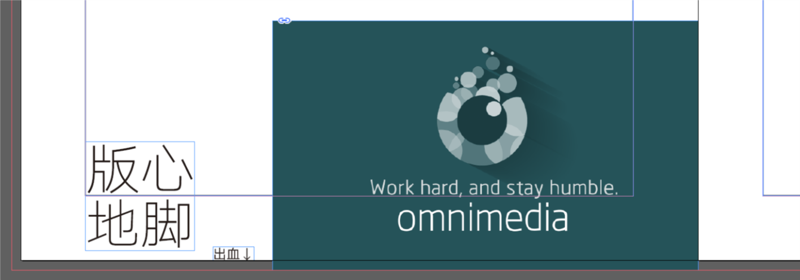
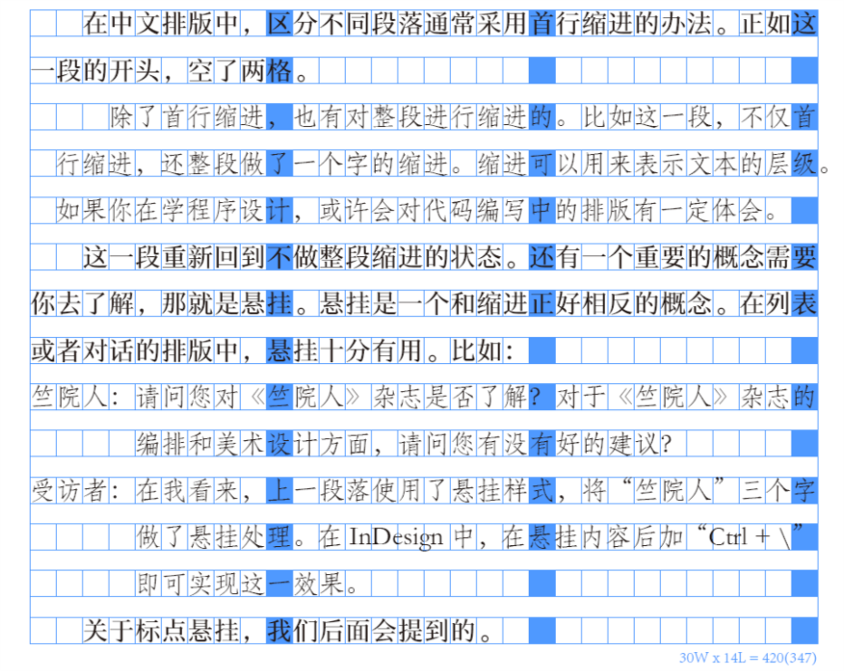
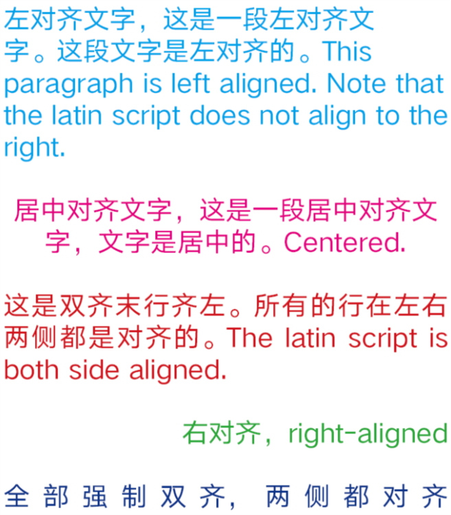
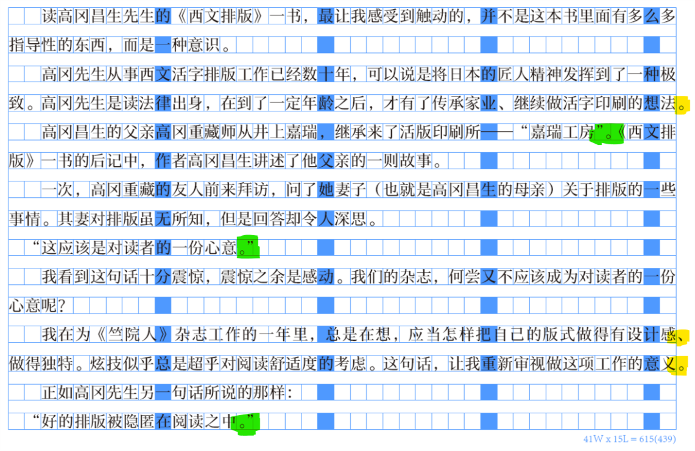

# 《竺院人》杂志内训参考资料02——杂志排版基础

读高冈昌生先生的《西文排版》一书，最让我感受到触动的，并不是这本书里面有多么多指导性的东西，而是一种意识。

高冈先生从事西文活字排版工作已经数十年，可以说是将日本的匠人精神发挥到了一种极致。高冈先生是读法律出身，在到了一定年龄之后，才有了传承家业、继续做活字印刷的想法。

高冈昌生的父亲高冈重藏师从井上嘉瑞，继承来了活版印刷所——“嘉瑞工房”。《西文排版》一书的后记中，作者高冈昌生讲述了他父亲的一则故事。

一次，高冈重藏的友人前来拜访，问了她妻子（也就是高冈昌生的母亲）关于排版的一些事情。其妻对排版虽无所知，但是回答却令人深思。

“这应该是对读者的一份心意。”

我看到这句话十分震惊，震惊之余是感动。我们的杂志，何尝又不应该成为对读者的一份心意呢？

我在为《竺院人》杂志工作的一年里，总是在想，应当怎样把自己的版式做得有设计感、做得独特。炫技似乎总是超乎对阅读舒适度的考虑。这句话，让我重新审视做这项工作的意义。

正如高冈先生另一句话所说的那样：

“好的排版被隐匿在阅读之中。”

我遇到过很多人，不理解为什么正文排版要用宋体。他们觉得，宋体很难看，于是选用卡通类型或是书法类的字体。他们没有明白，宋体的美就是隐匿在阅读中的。可能有点跑题，因为关于字体的要放到后面。但这是我第一句想说的，那就是，不要排斥宋体，宋体就像水一样，平淡中透出些味道。如果说水里含些甘甜清冽，那么宋体就是一抹的书香。

## 基础概念

### 构成

* 封面（封一）：   不必言说你也明白。
* 封里（封二）：   封面的背面。
* 封底里（封三）：  封底的背面。
* 封底（封四）：   这个你也应该懂的。
* 书脊：           连接封面和封底的部分，即书刊的侧面。
* 扉页：           打开封面之后看到的第一页。

### 页面

* 页边距：          页面内容与页面边界之间的距离。
* 天头：           上边距。
* 地脚：           下边距。
* 订口：           内边距。
* 切口：           外边距。
* 版心：           页面上的内容范围。

关于以上，需要做一个说明。天头、地脚、订口和切口这些页面边距的存在，最初是为了保护版心上的内容在书籍加工的过程中不被裁切。除了保护内容这一作用之外，这些边距还影响到阅读的舒适程度。一般来说，正文部分要尽可能地控制在版心以内。对于图片等等，是允许超过版心的。

* 出血：           为保留有效内容预留的裁切部分。一般3mm。

出血是页边距的边距，在大多数情况下，页边距是不会被裁切的，而出血是一定会被裁切的。在处理所有你希望和页面边距相接的图片时，该图片须布局一部分到出血。如下图所示：

图中红色框线以内，白色页面以外的空间就是出血。在印刷时，该部分会被裁切，希望与边界相接的图片须保留出血。

### 段落

#### 缩进与悬挂

#### 对齐

需要区分一下“左对齐”和“双齐末行齐左”，所谓双齐就是两端对齐。左对齐的文字在右端可能会是错落的，而双齐在右端是平整的。双齐保证了右端平整是通过调整行中文字的间距以及标点符号的挤压实现的。

#### 行距与行间距

行距指行的高度，行间距指行与行文字之间的距离。行距 = 行间距 + 字体大小。

#### 段落间距

段与段文字之间的间距。在中文排版中，段间距不是常见的分段方法。中国大陆一般采取首行缩进来区分段落。段落间距分段主要见于西文。在西文排版中，分段不仅可以用首行缩进去体现（规则与中文有所不同，后面会提到），也可以用顶格段落之间留出段间距的方法。

### 文字

#### 字体大小（字号）

字体大小是指文字的高度。相同字体大小（或是通俗地说——字号）的情况下，不同字体给人的视觉大小也是不一样的。即便在排版时占据相同的空间，宋体和黑体看起来往往比楷体和仿宋更大些（这也是宋体和黑体是首选的正文字体的原因之一）。

关于字体大小，以及上文中提到的缩进、悬挂、行距、行间距、段落间距，都需要一些单位去度量，这些单位在这里给出：

绝对单位：

* pt, point，中文一般翻译作“点”，也作“磅”等。1 pt 是 1/72 英寸。

还有 Pica 和 Cicero 等等，这里不展开了（笔者也记得不是很清）。关于这些单位与中国传统字号（如“五号字”、“小四字”）之间的换算，请参阅文献[2]。

相对单位：

* En，是 em 的一半，定义为字体大小的 1/2，传统上指大写字母 N 的宽度。
* Em，是 en 的二倍，定义为字体大小。传统上指大写字母 M 的宽度。

### 注意事项

简单归纳一下前文所述内容中，在实际操作时可能出现问题的地方。

* 使用空格实现排版目的是非常不优雅的，要尽可能避免。

## 西文排版须知

在讲中文排版之前，首先讨论一下西文排版中的原则性问题。

### 组织文字和标点使用

大家在用 Word 写文章时，有时会发现它给你加一些奇奇怪怪的下划线……这是语法与拼写检查。学会去使用它！这样才不会犯文字上的低级错误。

* 英文中的逗号、句号、叹号、问号等，前面不加空格，后面要加空格。

This is my first day.I love it!
是错误的。

This is my first day. I love it!
是正确的。

这一点是重中之重，从这一个细节可以看出一个人是否具备写英文材料的基本素养。

* 一定要区分两个引号、以及撇号。一定要避免直引号和撇号。Word 具有自动配对引号的功能，InDesign 的字符面板中也可以选择。
* 区分 en dash、em dash 和 hyphen（连字符）。在英语中，破折号的使用是有讲究的。英文破折号分为 en dash 和 em dash，二者分工不同。在不同的行文规范中，对两个破折号的使用规范的描述并不完全相同。

### 断词换行

在使用双齐去排英文时，不要害怕用连字符断词换行（将段落语言设置为英语时，InDesign 会自动断词）。

很多时候，使用连字符断词是有必要的。双齐排版为了使每一行右端对齐，需要调整字距和词距，这可能会影响到排版的匀称美观。而断词换行则可以避免字距与词距调整造成的排版不均问题。

### 段落

西文排版中，分段有若干种方式。在中国，书写方式是有国家规范的，而在西方，更多是约定俗成。

一种常见的方式，也是中文借鉴了的，是首行缩进的方式。注意，在西文排版中，首段不做首行缩进，从第二段开始才会用首行缩进分段。

另一种常见的方式是，每段顶格，段与段之间有间距。

## 中文排版规范

了解中文排版规范，不仅仅是文字编排上的，也有语言规范上的。这方面的最佳参考是《中文排版需求》，地址附在了最后。

### 文字与标点

语言规范相关将不做主要内容讨论，汉语语法与标点符号的知识请参考文献[6]。

#### 常见标点输入方式

在中文输入法下：

* 省略号…… Shift + 6
* 破折号—— Shift + -
* 间隔号·  一般是 `
* 顿号、   一般是 \
* 书名号《》 输入大于号和小于号
* 单书名号⟨⟩  没有直接输入方式。千万不要用英文大于号小于号代替，建议在输入之前先查一下。

#### 标点挤压

标点挤压是在中文排版中经常被忽视的一个问题。标点符号的宽度不是固定的。习惯上一个标点符号占据一个汉字的宽度。可是为了排版需要，比如为了行的双齐（两端对齐），会挤压一部分标点占用空间。这是出现标点挤压的第一个情形。

另外一个标点挤压的实例是，两个标点相邻的情况。

在用稿纸写作文时，大家应该有所体会，当两个标点碰到一起时，比如冒号和双引号，我们习惯把它们写到一个格子里。当在排版时需要这样做了，那就是标点挤压。InDesign 可以实现各种标点挤压，我们后面会讲到。

标点挤压的意义不言自明。在没有标点挤压的情形下，标点符号多的地方很容易出现稀疏情形，版面将显得不匀称。

#### 标点悬挂

行末点号悬挂是中文排版的一种常见做法。点号指顿号、逗号、句号等可以在行末出现的尺寸较小的标点。由于点号相比于汉字很小，将其悬挂出行会使文本看起来更加整齐。

图中黄色马克笔标注的是标点悬挂，绿色标注的是标点挤压。细心的读者可能注意到了左引号的处理，段首出现的左引号做了减小缩进处理。这不是常见做法，只是笔者觉得这个处理会使缩进更加整齐。

### 段落

中文的段落相信大家很熟悉，开头空两格，称作首行缩进。段间距不是常见做法。

## 参考文献与学习途经

1. 西文排版，高冈昌生 著，刘庆 译，陈嵘 监修，中信出版社
2. Wikipedia - Point(typography) http://en.wikipedia.org/wiki/Point_(typography)
3. Wikipedia - En(typography) http://en.wikipedia.org/wiki/En_(typography)
维基百科中对文字排印的相关术语解释得很准确。
4. Wikipedia - Dash http://en.wikipedia.org/wiki/Dash
5. Type is Beautiful http://www.typeisbeautiful.com
关于文字、排版的中文博客，篇篇精品。TIB 作为一个团体，也引介了大量优秀的设计类书籍，比如《西文排版》。
6. 中文排版需求 https://www.w3.org/TR/clreq/
对中文排版规范做的技术性解释，向万维网联盟提出了中文对于排版的需求。可以说是中文排版规范专业性最强的解释。文档是简繁混写的，这是由于作者来自不同地区，并且繁体字地区的作者对文档有着比较大的修订贡献。
