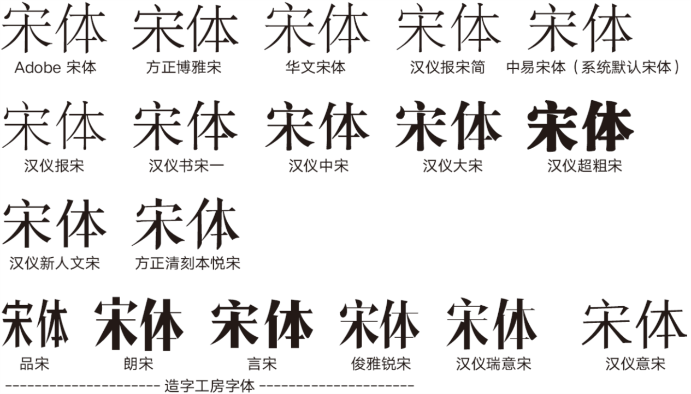
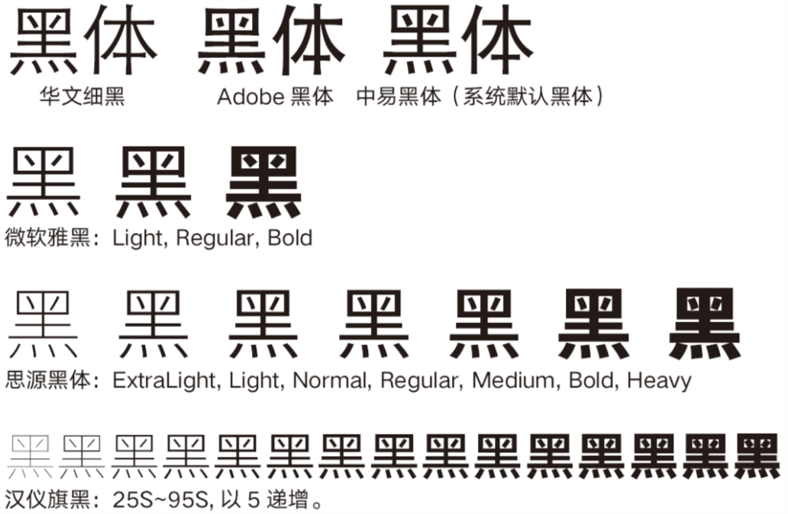
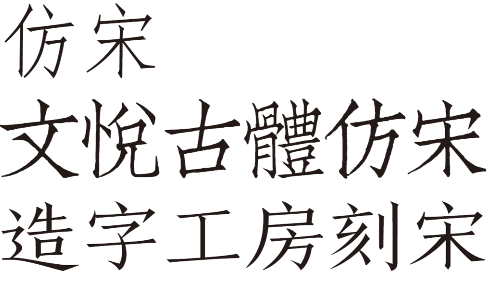
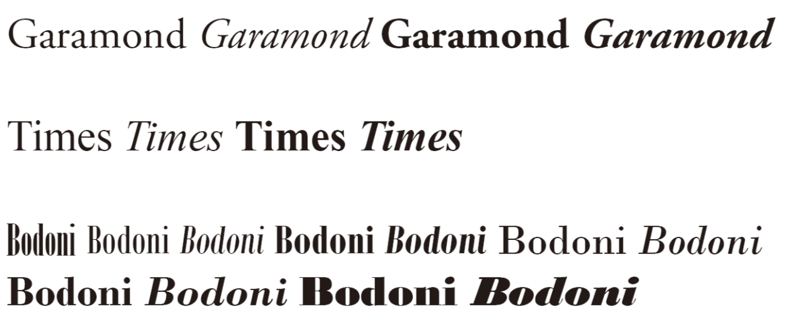
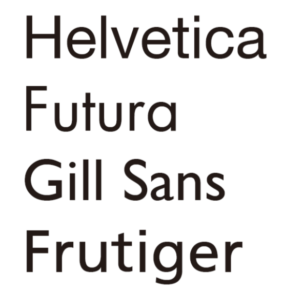

# 《竺院人》杂志内训参考资料03——字体基础

饮水不知其源，食米粟不知其所来。

字是人们思想的载体。我们往往将关注点放在了它所承载的东西，而忽视了它本身的外貌。这就像是一个节食减肥的人，只关注食物的营养成分，而忽视了味道这种带来快乐的东西。

另外一种情况是，我们品出了味道，吸收了营养，却闹出了“食物是从超市里买来的”这样的笑话。

字体不是电脑生成的，是字体设计师一个字一个字写出来的。多么想重说三的一句话。

总有一群人，不为人所知。他们曾经在木板上耕耘，也曾在铅与火之间劳作。刻刀不是冰冷无情的，而是温润的，试图走进人们心灵、并激发出人类最美情思的、传递情意的工具。一代又一代的做字人将自己的灵性注入到了文字之中，从而，我们的思想，才在纸张中有了形式之美。

下面讲一点字体的故事。

## 中文字体

中文印刷字体，传统上有宋体、黑体、楷体和仿宋，这是中文的四大印刷字体。

### 宋体

宋体是中国大陆的名字，在台湾以及日本，宋体通常被称为“明朝体”。通常说，宋体是发端于宋，而形成于明清，但是实际上，真正接近于今天宋体形态的印刷字体是出现于明朝，这也是在日本宋体被称作“明朝体”的原因。台湾的现代印刷技术来自于日本，故承袭了日本的名称，将这一风格的字体称为“明体”。

第一行是各种较细的宋体。细的宋体通常用于报刊正文，一方面是视觉原因，另一方面是，报刊的印刷可能会糊，细一点的宋体在印糊了的情形下也可以保证笔画清晰。

第二行是不同粗度的宋体。这些字体并不是同一家族的（是一个厂商的，但不是家族字体），但是粗度成一个系列。家族化宋体如方正雅宋家族，具有多个字重，没有放到上面。未完成的家族宋体有汉仪新人文宋和汉仪玄宋（两者目前都只发布了一款）。

第三行是和常规风格不太一样的宋体。新人文宋可能是未来的一个方向，而方正清刻本悦宋则是模仿古代刻本字体风格的宋体。新人文宋与上面宋体的不同主要在于，它的“笔锋”是按照硬笔书法设计的，而传统宋体的“笔锋”是按照毛笔设计的。方正清刻本悦宋则显得古朴而清秀。

第四行是以宋体为蓝本的字体。

#### 宋体的主要特征

宋体的主要特点是，它的字形方正，横细竖粗，横笔的末尾有一个三角形。有一个口诀是这样说的：横平竖直，横细竖粗，撇如刀、点如瓜子、捺如扫。

宋体给人典雅、端庄、传统的感觉，书卷气十足。宋体不是手写的，它起源于雕版。

宋体之所以会成横平竖直的形态（手写从来不会是横平竖直的。尽管竖画可以写得很直，但是横画，正常人写字一定是斜向右上的，这是右手习惯。如果不相信可以把纸翻转过来看看），是因为在刻版或是刻木活字时，沿着木头的纹理雕刻会比较容易。同样的原因也造成了竖画较粗。横画末端三角的存在，既是一种装饰，又可以在反复印刷后、横画磨损的情况下，暗示横画的存在，保证文字仍然可读。

宋体有时被称作“匠体”，它是技术的产物。

有一种说法，“宋体是楷体的抽象”。宋体以一种独具匠心的方式，保留了楷体的一些特征。

#### 为什么将宋体作为正文字体

很多人讨厌宋体。这里为宋体正名。

自明以降，这种字体就经常作为刻书的字体。宋体是传统的正文字体。

宋体相比楷体和仿宋，最大的优点是，它的笔画平直，结构方正，这使得在相同字号的情况下，宋体字更大，更容易读。横平竖直的特点使得视线可以在文字间平稳流动，特别是横排文字，宋体有助于提高阅读速度。

相对黑体，宋体富于装饰，更加典雅。这些装饰也起到了引导视线的作用。

#### 澄清宋体流言

* 宋体不是源于尺规作图。宋体源于刻刀，用尺规去写宋体是现代方法。
* 宋体并不是宋朝的字体。一般认为宋体真正的出现是在明朝。
* 宋体没有一个固定的发明者。宋体是逐渐形成的，它不是一个人的书法字体，更不是所谓秦桧发明的。

### 黑体

黑体并不是土生土长的字体。中国的黑体源于日本，而日本的黑体是源于西文的创新。黑体在中国只有一百年左右的历史。

第一行是传统黑体，中宫收得很紧（中宫是书法概念，中宫紧的字显得清秀，中宫大的字体显得肥大），而且笔画末端有喇叭口的微张。喇叭口是铅字印刷的产物，为了突出文字的方正而采取的措施。在铅字印刷时代，如果没有喇叭口，在小字情况下，笔画边缘会显得过圆。

后面的都是现代黑体设计了。现代黑体，在中国真正出现，应该是从微软雅黑开始的。Windows操作系统的中文显示一直十分糟糕，之前使用的宋体无论是在小字还是大字，都缺乏现代感。微软为解决这一问题，斥重金打造了微软雅黑一款字体。该字体由我国的字体设计大师齐立设计。并在Windows Vista中和大家见面。

微软雅黑可以说开启了一个时代。从此之后，黑体成为最常用的系统字体。微软雅黑也带动了一批现代黑体在中国的出现。

微软雅黑带动了一个浪潮，它成为了很多人最喜欢的字体。笔者也曾盲目地喜爱微软雅黑，但是雅黑有很多缺陷，并不适合做平面设计，不是优秀的纸媒字体。

* 微软雅黑为屏幕显示打造，字体中宫夸张地大，远离书写，工业感太强。
* 同样是为屏幕打造所带来的弊端，雅黑的字面很大（以后会说什么是“字面”），字距小，阅读很累。
* 还是因为它是屏幕显示字体所导致的缺点，微软雅黑有一些奇奇怪怪的问题，比如有的字会让人感觉悬起来，有的字又沉下去。
* 微软雅黑的三个字重（粗细）偏粗，无法满足需求。

后来方正发布了“方正兰亭黑”家族字体。微软雅黑其实是选择了兰亭黑的若干个字重，兰亭黑是真正完善了的雅黑。作为中国非常早的家族黑体，兰亭黑（有的时候是微软雅黑）被用在了各种场合。

渐渐地，出现了信黑体、思源黑体、汉仪旗黑等等家族黑体。汉仪旗黑依旧是齐立老师设计的，总共有71款不同字重、不同高度宽度的字体，可以是是创下了一个纪录。

在以上介绍的黑体中，需要特别说一下由Adobe和Google两家联合打造的思源黑体，它是中文字体中少有的开源字体，使用思源黑体是不用担心版权问题的。

#### 黑体的主要特征

方方正正，没有装饰，横竖的粗度处于同一程度。但这并不是说黑体的横竖都是一般粗的。笔画疏密不同处的笔画是不一般粗的，这只有细心观察才会注意得到。

黑体同样十分端庄，但是更多的是一种严肃。横竖平直，和宋体类似，但是没有装饰，让它变得与传统字体完全不同。黑体通常给人以现代感。

#### 黑体的用途

传统上认为黑体只能做标题字体。实际上并不是这样。宋体也可以做标题，黑体也可以做正文，但是要选取合适的字重。

黑体做标题的时候通常选取极其细的字重或是极其粗的字重。后一个是传统做法，而前者则是比较新的设计。细的黑体与扁平风格十分搭配。

### 仿宋

仿宋是真正的宋朝字体。它源于宋代的刻书字体。

第一行是现代仿宋，几乎所有的现代仿宋都长一个样子，这个样子是在新中国成立之后形成的。

第二行是文悦复刻的聚珍仿宋，聚珍仿宋是民国时期的一套活字。这个字体更加接近传统的印刷字体。

第三行是造字工房参考传统的宋代字体创新出的造字工房刻宋，也是源于宋朝的印刷字体。

#### 仿宋的主要特征

仿宋大量保留了手写风格，这也是一个可以用笔写出来的印刷字体。仿宋字帖是可以买到的。

现在看到的仿宋大多比较高瘦。仿宋的变化比较少，只有高矮胖瘦，粗细和笔形没有太多变化。

由于仿宋是一种十分细的字体，其在屏幕上的显示效果不佳。但是打印出来的仿宋给人以一种清秀优雅的感觉。很多文艺文章会选择使用仿宋排版。

#### 仿宋的用途

仿宋是一个公文用字体，也是一个工程用字体。在中国大陆，有公文正文使用仿宋的规定。工程制图的字体也需要使用仿宋。人们一方面认为这是传承宋代的工程传统，另一方面，仿宋也是少有的可以书写的印刷体。

### 楷体

楷体相信大家都不陌生。楷体是汉字的标准手写体，作为印刷字体也是非常常见的，通常用于排版引用、导语、定理等等。

清朝的图书，使用楷体印刷的很多，字形尤为清秀，非常漂亮。

### 中文字体厂商

在上世纪90年代，字体设计一度是热门行业。计算机的出现使得汉字排版迎来一个革新，此时数字化中文字体出现巨大需求缺口。

好景不长，字体盗版猖獗（今天也是），新出现的一批字体厂商很快就倒了大半。在中国大陆，留下来的只有北大方正、汉仪科印、常州华文和中易中标。其中后两者几乎不再做新字体了，主要做一些维护和代工。最近几年也有新的字体厂商出现。

现在（中国大陆）的中文字体厂商主要有：

* 方正：大厂，服务出版行业
* 汉仪：也是大厂，服务广告行业出身（个人感觉汉仪的字近几年做得比方正好）
* 造字工房：以家族创意字体、标题字体见长，平面设计师丁一创立，上海迪士尼的视觉设计就是由该厂做的
* 文悦：康熙字典体作者厉向晨创立，做复刻字体
* 新蒂：民间造字力量，专注手写体，字做得都很萌

现在字体设计依旧是活得不好……好在几个大厂找到了巧妙的赚钱方法。他们随便出几个手写体或是萌系创意字体，然后在手机上发售，就可以骗得无数少男少女的硬币（True, 这让他们终于可以赚一大笔钱。你们在手机上换的字体实际上是造价非常低廉的，而一款宋体或是黑体不知道要比做一款手写体贵到哪里去了。这样说会不会有点嘲讽……然而真正优秀的东西隐匿在看似没有个性的平淡之中）。

### 其他

字重、字面、中宫、中心线、第二中心线等等以后有机会再说吧~

## 西文字体

先要解释一下“西文”。可能有的同学看到这两个字会有点懵。“西文”的字面意思是西方文字，对应于英语的Latin Script. 英文、法文、德文都是西文。

西文字体也分为多种，关于英文书法，我会发一点资料的，感兴趣的同学可以练一练。

西文印刷字体粗略地可以分为衬线体（Serif）和无衬线体（Sans-serif），其实还可以进一步细分。所谓衬线，就是字母上的装饰线，类似于宋体横画的三角（有时也将宋体的装饰称为“衬线”，或是认为宋体是中文的衬线体。这都是借用了西方的概念。在日本，宋体的不同装饰是有不同名称的，而在中国目前还没有定论，所以只能用“三角”等等模糊概念，或是套用“衬线”的说法）。在中西文混排时，一般用衬线体与宋体搭配，无衬线体与黑体搭配。

### Serif

这三款可以说是不同Serif的代表了。Garamond是典型的Old Style（老式），Times是Transitional（过渡式），Bodoni是Modern（新式）。

可能你现在对这三款字还没有什么感觉……印刷体好像都是画出来的……没关系，有机会的话我们可以动手写一写。印刷体并不是无缘无故画出来的，任何一个印刷体都不可能脱离手写凭空地造出来。

观察敏锐的话，你应该注意到了三款字的粗细分布方向不同。Garamond的粗细是斜向分布的，而Bodoni完全是横竖分布粗细的。

### Sans-serif

脸盲的你可能一上来会有点蒙……这有什么区别吗？这是几款最为著名的Sans-serif，也代表了不同风格。

Helvetica是经典中的经典，如果你是果粉，接触这个字体最频繁的地方大概就是苹果电脑和手机了。这一优秀的字体经久不衰，它代表了瑞士风格。这个字体经常会在不经意间刷脸。

Futura也是非常经典，几何风格的无衬线字体。

Gill Sans，英伦风，十分正派，但是它的作者，鬼才Eric Gill的为人可不是那么令人钦佩。Gill是个疯子，曾经做出过很多让人觉得违背伦理的事情，对他的故事感兴趣的话可以戳：http://www.typeisbeautiful.com/2011/04/3610/ ，后面有一段小黄文，全程高能预警。

Frutiger，人文体经典。给人感觉十分舒展，经常用作导视字体，比如在机场、医院的导引牌。这个字体可以说开了一个大坑，你今天所能看到的大多数手机上、电脑屏幕上的字体都有它的影子。比如苹果上的系统字体Myriad（苹果系统字体大概是比较讲究吧，好像又有用Helvetica的地方，又有Myriad的地方，我很乱……表示没用过苹果的东西）、Windows上的Segoe、一打开Word就看见的Calibri、安卓上的Source Sans等等等等，感觉都和这个字体很像不是吗……

### 特别说明：粗体与斜体

西文也是有做不同字重的，粗度可以不同。

斜体，有时候是Slant，有时候是Italic，这个要看具体字体的设计情况。Slant仅仅是将字体做了倾斜处理，而Italic则是按照意大利体的写法去写。Italic相比于Slant的好处是和不斜的更具区分度。Serif的Italic接近传统的意大利体，但是给Sans-serif做Italic也已经成为惯常做法。Italic不能成为与Serif和Sans-serif并列的一种字体，因为Serif和Sans-serif都可以有Italic。

字可以既粗又斜。当然可以！数学上我们用既粗又斜的表示向量呢！其实在日常应用中也会遇到既要粗又要斜的情况。

至于怎么选择不同字重、不同倾斜、不同高矮胖瘦的字体，讲InDesign使用时，会交待给大家的。

## 参考文献与学习途经

特别推荐去看[3]，非常享受，绝对会有收获。

1. 西文字体，小林章 著，刘庆 译，陈嵘 监修，中信出版社
2. 西文字体2，小林章 著，刘庆 译，陈嵘 监修，中信出版社
3. 活字字体的基础讲座，今田欣一，Eric Liu和Metaphox译，http://www.typeisbeautiful.com/kinkido-0/
这一系列文章从日本视角讨论了中西文字体的历史与复刻，是了解基础知识不可多得的材料。
4. Wikipedia - Serif https://en.wikipedia.org/wiki/serif
5. Wikipedia - Sans-serif https://en.wikipedia.org/wiki/Sans-serif
6. http://www.typeisbeautiful.com/2011/04/3610/
Eric Gill的故事，黄文预警！
7. 几个知乎话题：
* 字体 https://www.zhihu.com/topic/19551016/hot
* 中文字体 https://www.zhihu.com/topic/19551034/hot
* 字体设计 https://www.zhihu.com/topic/19551036/hot
* 中文字体设计 https://www.zhihu.com/topic/19551960/hot
* 排版 https://www.zhihu.com/topic/19553684/hot
