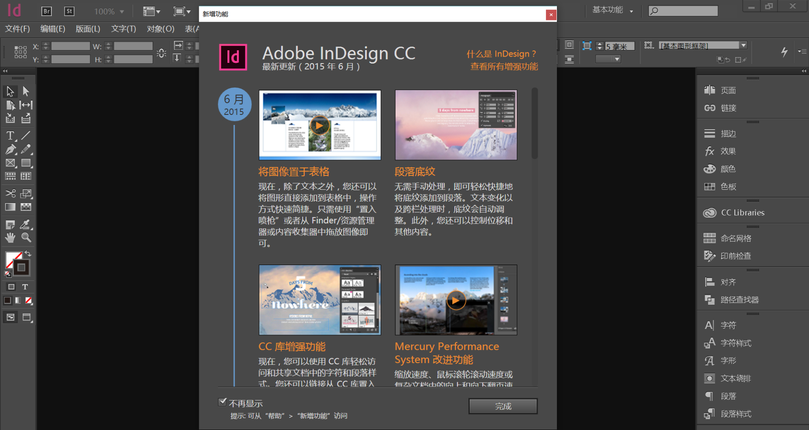
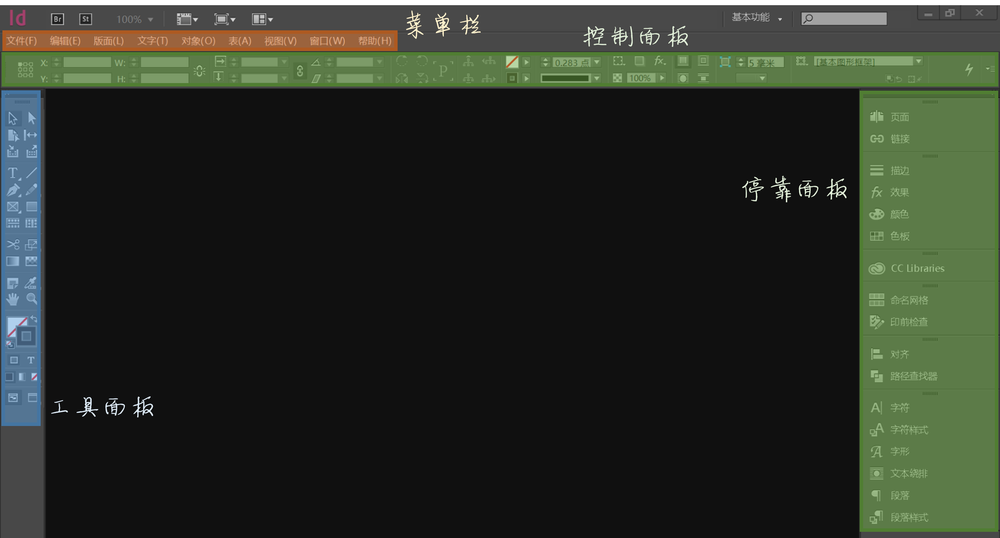
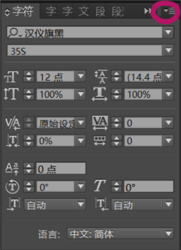
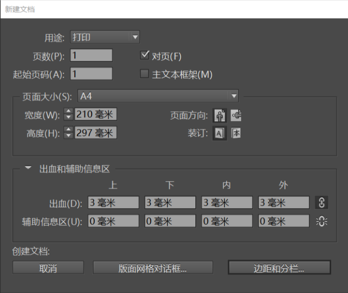
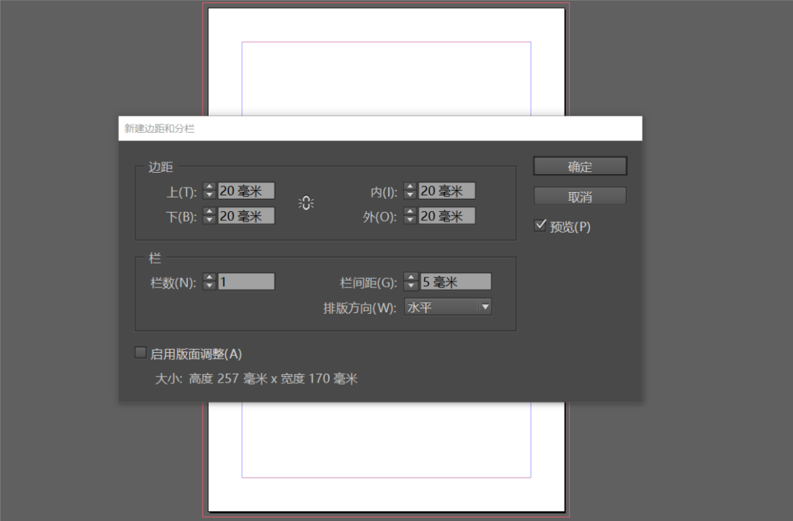
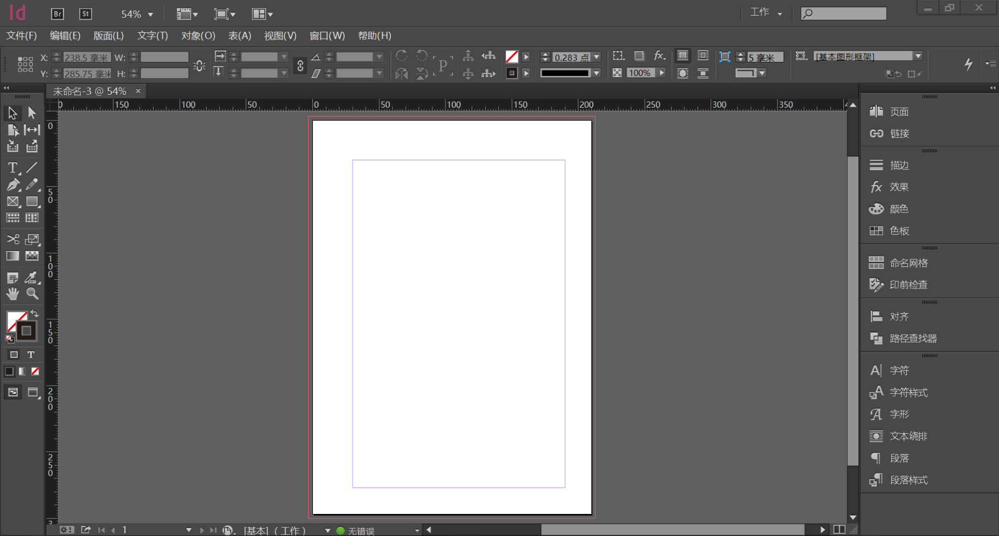
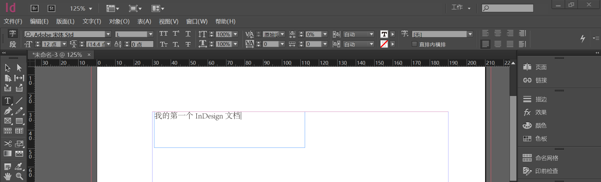
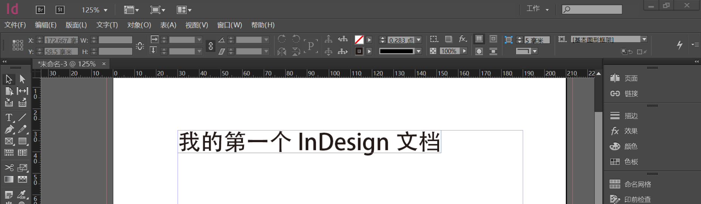
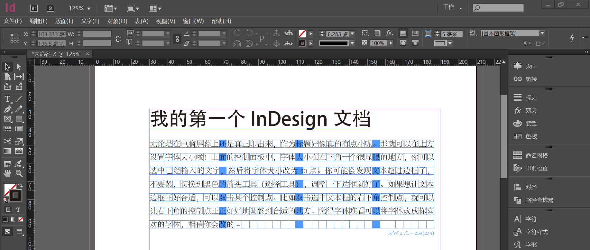

# 《竺院人》杂志内训参考资料04——InDesign in design

> 神奇的Adobe啊，我以技术废之名命令你，赐予我力量，让我消灭这邪恶，改变世界吧！

Adobe (/ˈədoʊbiː/, 谐音“额逗比”)的名字来自于一条小溪，这个名字没有什么特殊的含义，而它成为了这个改变世界的公司的名字，是因为恰好流经两个创始人家的房后。

Adobe这家公司不像微软、苹果那么耀眼，但是翻开历史会发现到处都有它的名字。它出品的Photoshop，甚至给汉语增添了“PS”这个新词（参见《现代汉语词典》）。Adobe Creative Suite的那些软件，让无数人沉溺其中——每个人都想把它那元素符号一般的、花花绿绿的图标集齐。

Adobe InDesign经过十余年的发展，已经成为出版行业必不可少的利器。但是这个以紫色为主色调的软件，在外人看来是显得那么陌生与神秘。

笔者刚到杂志工作室的时候，学姐说，用InDesign是因为它简单嘛。其实上手还是比较简单的吧，但是选择了这个工具可不只是因为它简单，更重要地，它专业，有着其他工具无法替代的许多特性。

## 邂逅

上图中，我们将主界面各个部分做了个小标示，方便以后交流~

### 先玩玩界面好了

我截到的图片是我自己平时工作用的界面，当然咯，已经改过很多了，把很多藏得很深的功能调了出来。

Adobe系的软件，界面都是可以自己去定制的，你看到的这些面板都可以拖来拖去……可以试试。

现在可以尽情地去玩这些面板……没有关系的，弄乱了都没有关系。你可以尝试把所有面板弄乱，然后再一个个拖回原来的地方。

实在搞不回来了也没有关系。在上方的菜单栏找到“窗口→工作区”，然后选择一个工作区，就又可以变回来。但是不同工作区的布局也是不一样的哦，你可以慢慢摸索~

“窗口”菜单的下面一部分有很多选项，每个选项都对应一个面板。这些面板可以帮助你去完成相应的任务，而且也都是可以拖来拖去的。可以尝试一下把新加进来的面板拖到右侧的停靠面板中去。

真的很好玩……单单是InDesign的界面就足够摸索一会儿了，多尝试一下将面板拖来拖去，也尝试一下面板上方的一些按钮

很多面板都有这个按钮。点开它！你会发现新大陆！很多功能就是藏在这里哦！

除了各个面板很好玩之外，上方的控制面板也很有意思。它的内容不是固定的。左侧的工具面板可以切换正在使用的工具。当你切换的时候，你会发现，上方控制面板的内容也在发生变化！

各个菜单里面也藏着很多的宝贝哦！学习一个软件本身就是摸索的过程，如果碰到了哪个选项的名字不知道了，可以去问问神奇度娘，很快就会知道怎么用的。

### 感觉很晕？

刚刚接触是不是已经被弄晕了呢？其实没有那么难啦。找到几个常见的找功能的地方：

* 工具面板切换正在使用的工具
* 上方的控制面板会很智能很贴心地把相关功能放到上面
* 右侧停靠面板可以点开的
* 通过菜单“窗口”可以添加新的面板，这些面板你可以让它悬着，也可以把它贴到右边的停靠面板
* 上方菜单栏调出来的菜单可都藏着宝藏哦
* 每个面板的右上角也会有一个神秘入口，那里面还藏着很多功能

### InDesign的大体玩法

InDesign并不能直接打开图片或是Word文档什么的哦！它只能够打开InDesign文档，比如最主要的一种，.indd。

如果想要做排版工作了，可以新建一个文档，然后开始在上面自由地画！

画完之后当然就要保存咯~保存的时候是会存成.indd格式的，当然，笔者建议不要在最后时刻才保存。**在电脑上做工作一定要养成随时保存的习惯！新建了文档的第一件事最好就是保存，保存到一个安全的地方。然后每做几步，就保存一次。在大多数的软件上，保存都是“Ctrl + S”。**

保存完之后就可以在下次接着做的时候打开了！

需要注意的是，InDesign默认不会把你插入进来的图片嵌在文档里面。也就是说，如果你需要把文档拷贝到别人的电脑，**复制这些图片，或将图片都嵌入文档是必须的**。

最后做好的文档当然是要打印出来的啦！一般情况下，.indd只做编辑使用，印刷和电子发布是要用.pdf格式的。这就需要导出。导出的选项同样可以在“文件”菜单当中找到。具体怎么办，不要着急啊~后面会说的。

## 我的第一个InDesign文档！

现在你就要排自己的第一个InDesign档了！是不是很兴奋呢？让我们开始吧！

### 新建文件

和大多数的软件一样，“文件”菜单负责找到新建、保存、另存为等功能。然后呢，你就可以新建文档了！

找到“文件→新建→文档”就会弹出“新建文档”对话框。

似乎都很好懂的……都是大白话。基本上也不用更改的。如果希望从左面开始的话，可以将上面的“起始页码”一项改成双数，比如“2”。页数不必担心，新建文档之后可以增加页数的。

出血的话前面我们有提及，上下左右各保留3mm就好啦。

没有什么问题就可以点“边距和分栏”进入下一步了。

现在你已经可以看到自己新建的页面了呢！这一步要设置边距和分栏。其实这些设置在新建完成文档之后也可以修改的。

《竺院人》杂志的边距是，上30，下20，内30，外20。分栏自定。

第一次尝试，我们就不分栏啦。

### 额，一张白纸

看到这么一张白纸是不是有点不知所措呢？

InDesign和Word很不一样……Word的信息处理可以说是线性的，连排版也是线性的。而InDesign给你一个自由的机会去自己画豆腐块，因而你刚刚定的边距不是死的，这些边距唯一的意义就是供你布版的参考线。

InDesign和Photoshop也不太一样。它不是那么依赖图层，不会出现跨图层无法选中的现象……

其实刚刚接触InDesign你会觉得更像PowerPoint一点，很多地方都非常相似。

这张白纸会是你发挥创意的地方。最后读者会看到的是白色的部分，灰色是会被裁切的。红色框框是出血框，在布局的时候还是要将有的图片延伸到这里的，虽然最后红框内的灰色部分会被裁掉。蓝色框内就是版心啦，也是主战场。正如前面所提到的那样，有效的信息要放到版心里面。

### 操控！

如何处理你和你面前这张纸的相对位置呢？

尝试做这样几件事：

* 滚动鼠标滑轮
* 按住Ctrl键，滚动鼠标滑轮
* 按住Alt键，滚动鼠标滑轮

你一定了解到了什么。

这个就和手机上的双指放大缩小一样好玩。

### 在读者看到的和你看到的之间切换

在编辑过程中，你看到的是……到处的框线，各种辅助线，没错吧！但是读者看到的一定是干净的啊，那么我怎么预览一下呢？

非常简单，按一下键盘上的W键！就可以在预览和编辑状态下切换。

## 要开始写字啦！

### 熟悉一下工具

想要在上面写字，就要用到左侧工具面板中的工具。相信你一定看到了那个“T”字母图标。是的，那就是文字工具。

但是插入文字的工具不止这一个哦！所有右下角带着小三角的图标都可以展开。在文字工具的图标上长按鼠标，你会看到一系列的工具可供选择。

除了文字工具展开的工具，下面两个网格工具也可以插入文本框，并且对汉字来说还更实用一些呢！

如果有任何图标名称之间对不上号，将鼠标悬停在图标上，就会出现提示哦，这个经历应该都有的吧~

### 文字工具

我们用文字做一个标题！

点开文字工具，在版面中拖拽出一个框框。

然后就……可以打字啦！

无论是在电脑屏幕上还是真正印出来，作为标题好像真的有点小呢。

那就可以在上方设置字体大小啦！上面的控制面板中，字体大小在左下角一个很显眼的地方，你可以选中已经输入的文字，然后将字体大小改为30点。

你可能会发现文本超过边框了，不要紧，切换到黑色的箭头工具（选择工具），调整一下边框就好了。

如果想让文本边框正好合适，可以双击某个控制点。比如双击选中文本框的右下角控制点，就可以让右下角的控制点正正好好地调整到合适的地方。

觉得字体难看可以将字体改成你喜欢的字体，相信你会改的~

效果可能是这个样子。

### 用网格排汉字

找到水平网格工具，画个豆腐块出来！没有找到水平网格工具？找到刚刚那个“T”的图标，向下面找，依次是钢笔、一个中间画了叉叉的方块，然后就是水平网格工具了。

画完豆腐块之后就可以用文字工具向里面添文字了。填完之后可能是这个样子：

是不是有点像小学时候写的作文？没有错！很多排版的基础概念蕴含在小学写作文的格式之中。现在先不必着急空两格的问题，日后会讲的。

至于网格，不必担心读者会看到。能看到的只有你。按一下W试试！

## 保存与导出

恭喜你！你完成了自己的第一个InDesign文档！虽然很简单，但是这是日后复杂版式的基础。

在“文件”中找到“保存”，或是按照前面的忠告，边做边存。

现在这个样子，你还不能拿到文印店里面打印。所以你需要导出。找到“文件→导出”，然后在保存类型中找到“Adobe PDF（打印）”，剩下的和正常的保存过程是差不多的。之后弹出来的选项窗口可能会把你搞懵，可以试着去看一下大概什么意思，毕竟早晚都要去了解嘛。如果没有耐心去看的话，直接“导出”就好啦。

现在你得到了输出的PDF文档，你可以拷贝到U盘里面，去文印店将它打印出来啦！

## 参考文献与学习途经

1. 最好的学习途经就是碰到不会的就用搜索引擎搜索，讲不懂的功能输入进去，选择合适的关键词，大多数情况下都会找到答案。
2. InDesign的官方文档，专业性很强的参考 https://helpx.adobe.com/cn/indesign.html