# 《竺院人》杂志内训参考资料05——排一张名片

国庆快乐！

今天讲一点进阶内容，希望接下来的文字可以帮助你排出一张属于自己的漂亮名片。

## STEP 1 创建文档

创建一个新的InDesign文档，页数为2，取消“对页”的勾选，在页面大小中找到“转至名片4”，出血设置为上下左右各2mm。

在边距与分栏中，设置为上下3mm，左右5mm。栏数设置为2，栏间距0mm。

新建完成之后就是这个样子：

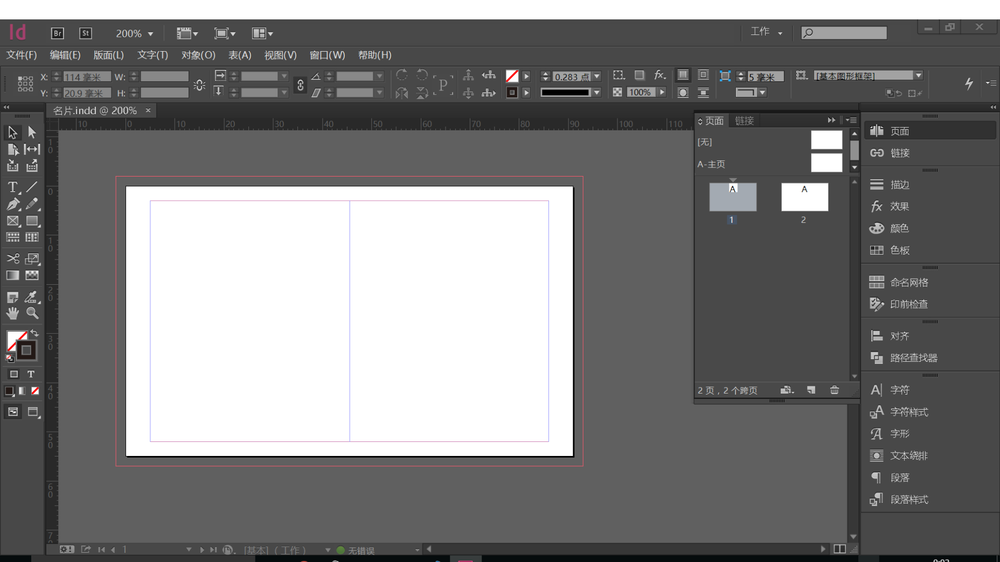

## STEP 2 写上自己的名字

在名片右部居中的位置，用文字工具画出文本框，在其中打入自己的姓名。字号12pt，选择你喜欢的字体，这里我选的是新人文宋，对齐方式设置为全部强制双齐（对齐选项在上方的控制面板的右侧）。

在下方画出另一个文本框，在里面输入你名字的英文，字号为8pt，将姓当中的小写改成小型大写，插入小型大写的方法，请找到“字形”面板，在其中选择小型大写字母。

单独说明一下搭配的英文，如果是较细的宋体、仿宋或楷体，可以尝试Adobe Garamond Pro，如果是稍粗一些的宋体可以尝试Minion Pro Medium。黑体可以尝试搭配Helvetica或Gill Sans等。

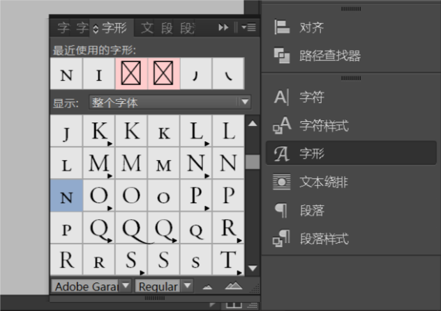

在“字符”面板中找到“字符间距”，选择稍稍大一些的字符间距。

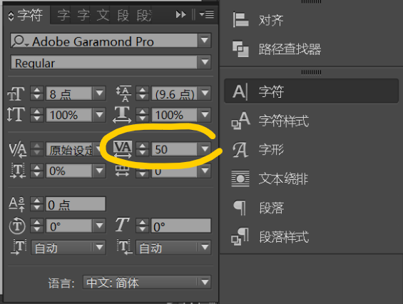

调整你英汉姓名在文档中的位置。最终效果如图：

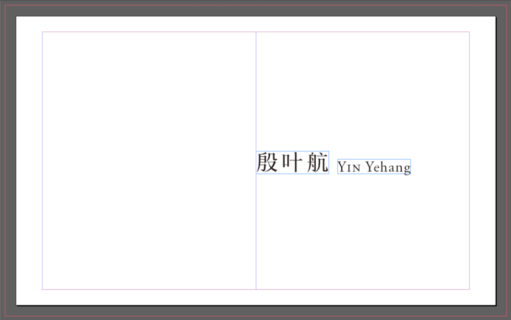

## STEP 3 插入自己的职务、地址等等……

也是插入文本框，和上面很像，就不多说了。做完的效果大致是这样：

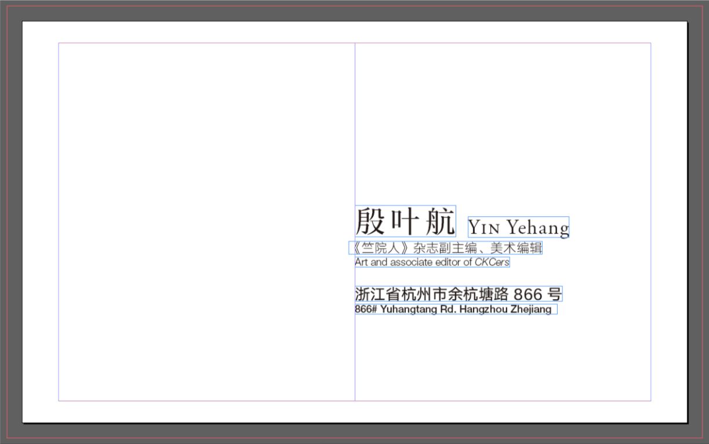

字体和字号说明一下：

职务中文用的是汉仪旗黑，字重40S，5pt，英文用的是Helvetica Neue LT Pro，字重46 Light，4pt。

信息中文用的是汉仪旗黑，字重60S，6pt，英文用的是Helvetica Neue LT Pro，字重65 Medium，4pt。

## STEP 4 插入一些图标~

可以尝试插入一些图标作为信息的标注。找图标可以去阿里巴巴矢量图标库里面去找：http://www.iconfont.cn/ 在图标库中搜索想要图标的名字，就可以找到了。还可以改变颜色然后下载哦！下载选择的格式，在这里可以选择AI下载，下载完之后就可以在Illustrator中打开。

下载完之后就可以在Illustrator里面打开啦~

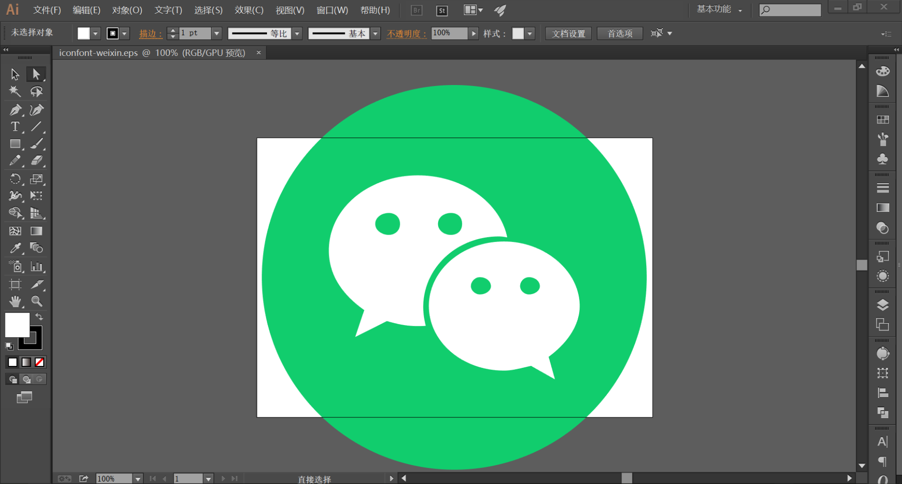

在Illustrator中选中图标，“编辑→复制”，然后在InDesign中粘贴，图标就会被粘贴到InDesign。在InDesign中改变图标的大小直至合适为止。

想要快速地改大小，可以在选择工具状态下的控制面板中找到宽度和高度设置，左边的“W”和“H”就是宽和高的设置啦。

可能节奏有点快？但是最终排出来是这个样子：

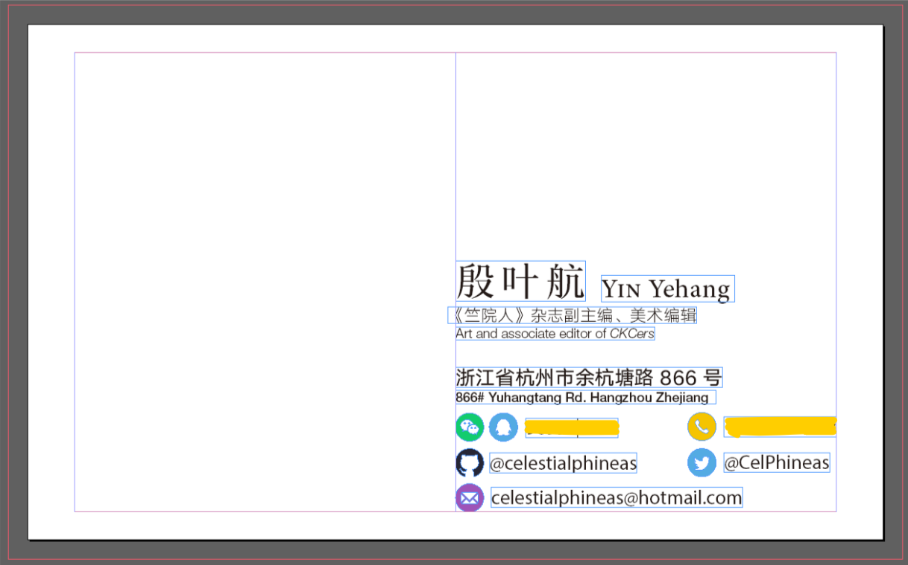

为了清晰，英文和数字字体改用了Myriad Pro。在这里有些信息出于隐私考虑打了马。

按一下W，就可以看到预览效果啦：

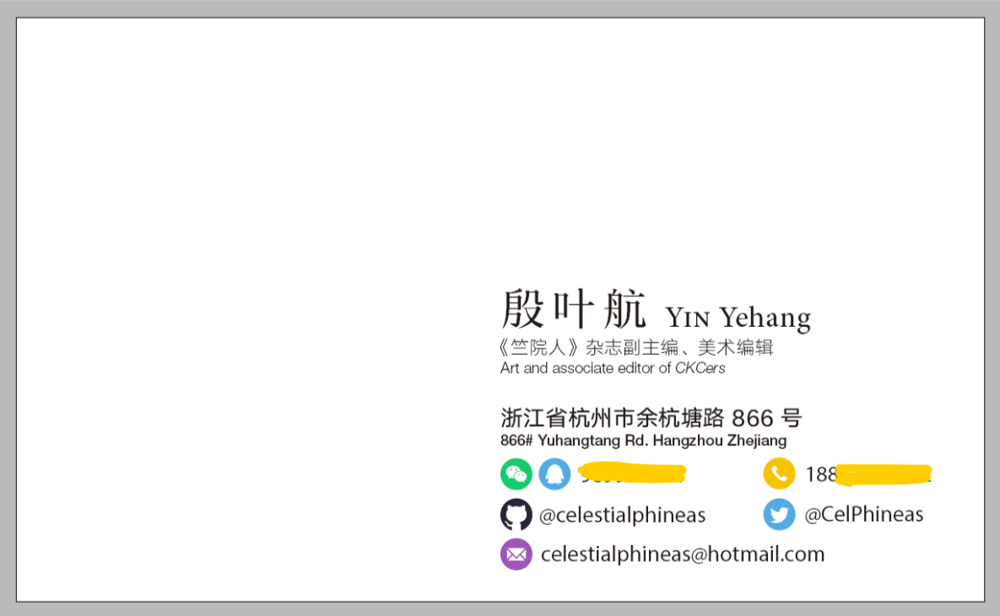

## STEP 5 加入Logo！

现在看起来是不是已经像是一张名片了呢？我们加入一些logo吧！

把杂志工作室的logo加入到左上角，设置好适当的大小。杂志工作室的logo我会给大家的~

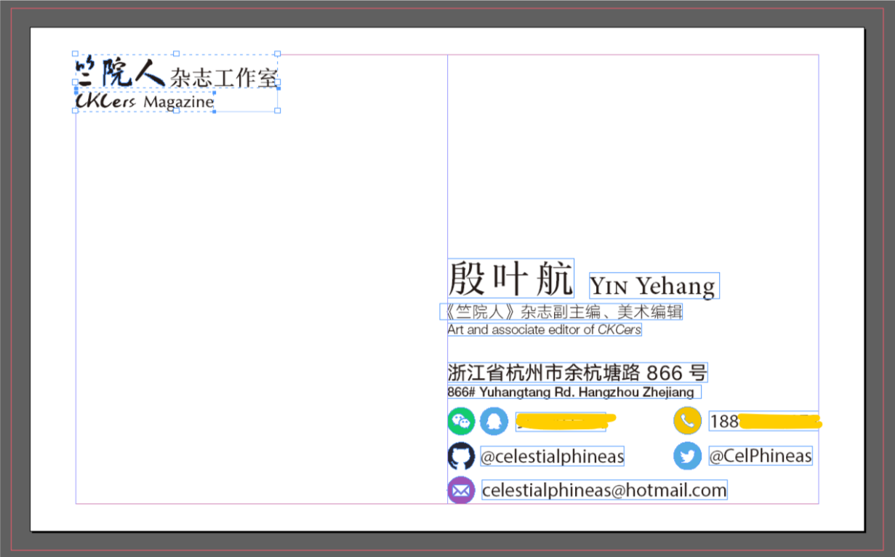

在左侧的工具面板中找到多边形工具（多边形工具和矩形工具以及椭圆工具是折叠在一起的），双击多边形工具的图标，会弹出一个对话框：

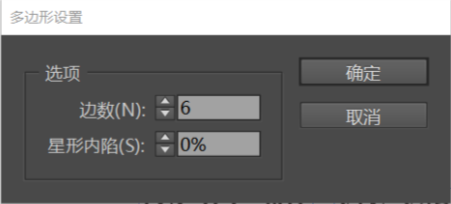

在里面设置上你喜欢的数值，喜欢几边形就写几边形啦。设置完成之后就可以画了。画完之后调整合适的大小与角度（和其他软件的操作方法都差不多，控制选框上的点调整大小，将鼠标靠近选框上的点，当光标变成旋转的图标就可以旋转框框了）。

颜色的设置在上面的控制面板可以找到。当图形处于选中状态时，你会看到这样两个东西：

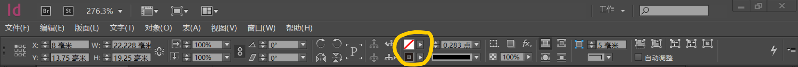

点开之后就可以设置颜色了。InDesign中颜色的使用可以参考这个： https://helpx.adobe.com/cn/indesign/using/color-1.html

找颜色可以去Nippon Colors上面去~ http://www.nipponcolors.com

画好这个多边形之后就是这个效果啦：

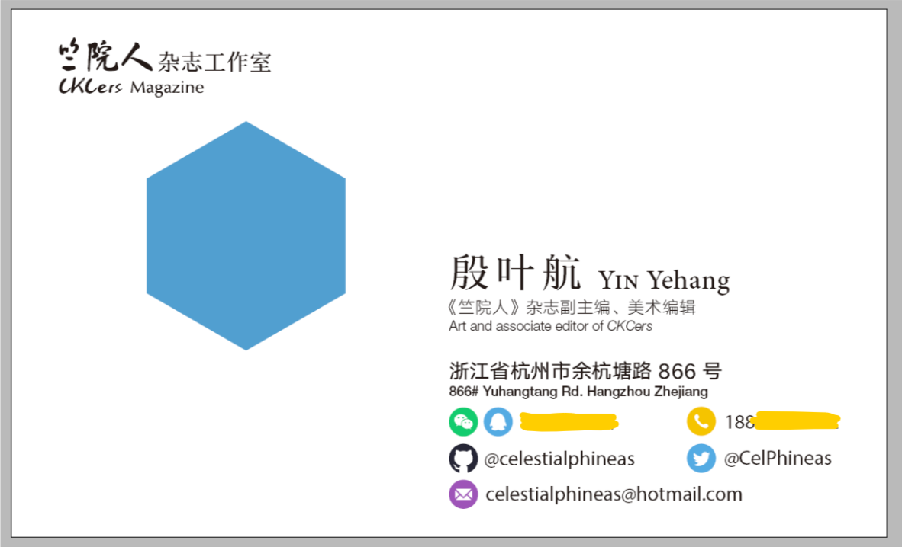

然后在画好的图形上放上全媒体logo吧！直接把logo文件拖到InDesign里面就可以插入进去了！

在这个过程中，你可能会碰上些小麻烦，比如发现改变大小时，改变的只是框框的大小，而图标还是原来那么大。没错，改变图片大小时，选中图片周围的结点只会改变图片定界框的大小。那么应该怎么办，才能改变图片大小呢？

在上方控制面板的右侧，你会注意到：

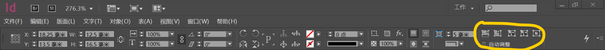

在这里多戳一戳试试！你很快就会了解到怎么办了。

另外一个问题是，全媒体白色logo的颜色有点太淡了怎么办？最简单的方法是，复制一份，然后叠加上去。

最终效果是这样：

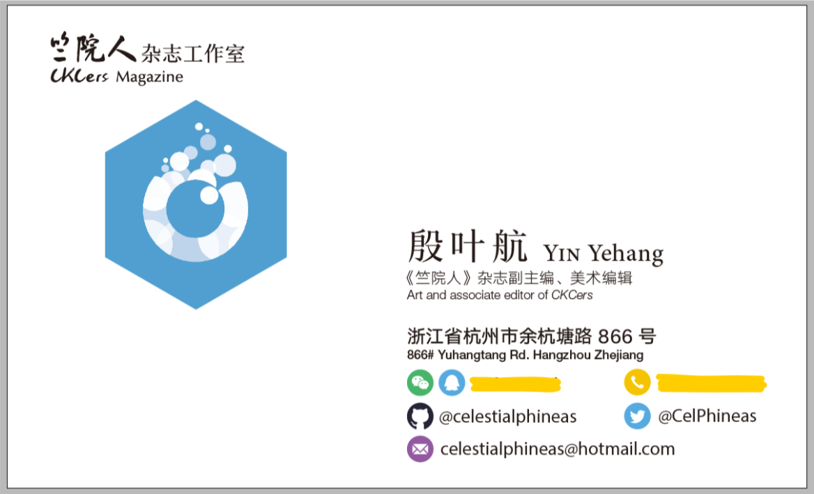

## STEP 6 细节修饰

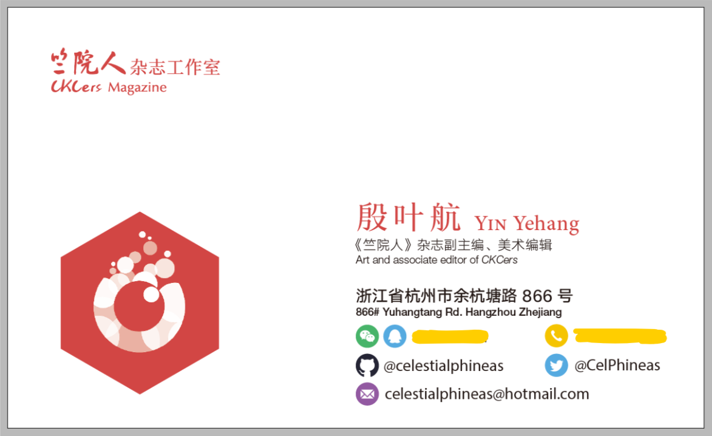

## STEP 7 绘制名片背面

不知道学弟学妹们对我们纳新头像是否有印象……是的，这些纳新头像都是用是用笔者写的生成器生成的： http://celestialphineas.github.io/omnimedia 

用这个头像生成器的相关资源，我们可以做出各种效果。资源我会发给大家的~

在第二页画一个和出血框一样大的矩形，作为背景。矩形颜色建议前后呼应哦~

然后在上面组合资源吧！把那些全媒体logo拼来拼去！

资源当中有一个扁平风阴影的图片，拖到InDesign发现效果好丑，该怎么办呢？

选中图片，在上面的控制面板找到图标形状为“fx”的按钮，点开后找到“透明度”，再点开，就会弹出效果对话框：

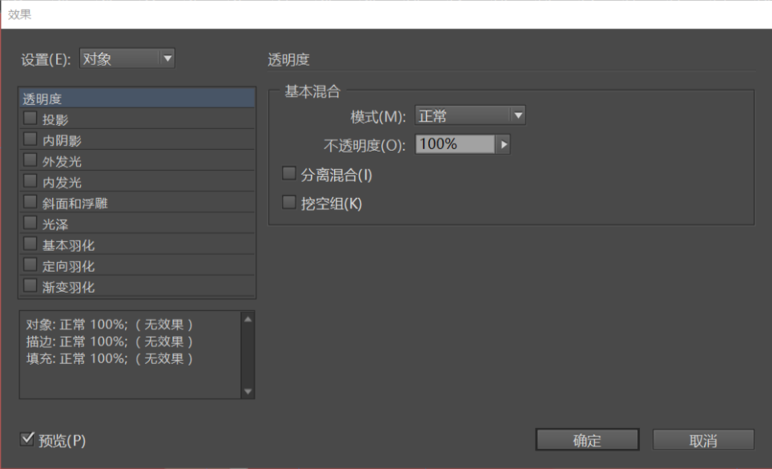

把“模式”中的“正常”改成“正片叠底”就好啦。

当logo调整到效果满意后，就可以插入文字啦！全媒体中心用的主题字体是造字工房悦黑。

我还有加院徽的，院徽的资源我也会给大家。

## STEP 8 导出

“文件→导出”，在保存类型中找到“Adobe PDF（打印）(*.pdf)”。

然后会弹出对话框：

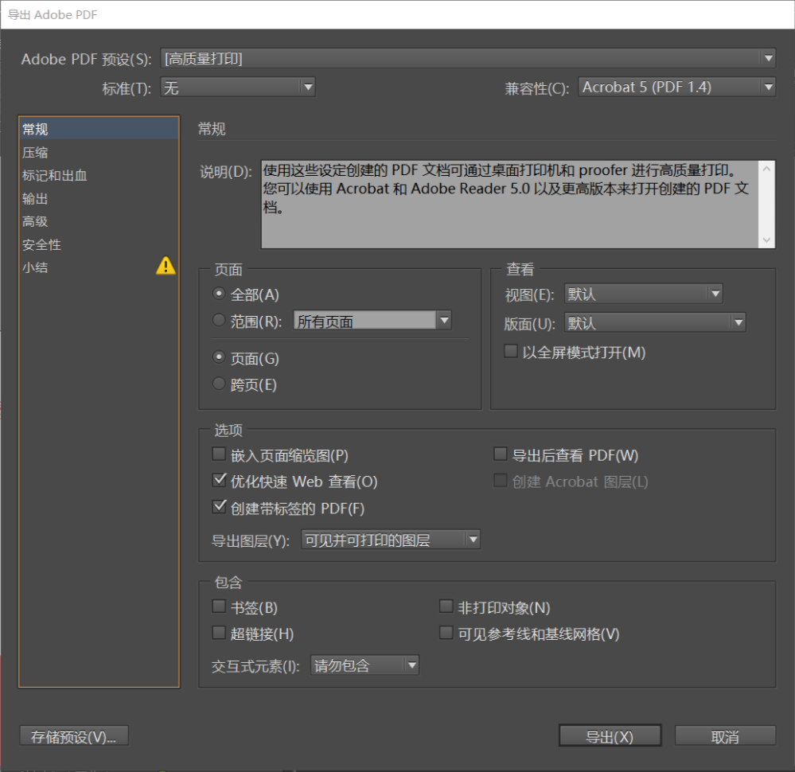

上方“Adobe PDF预设”里面选择“[高质量打印]”，在对话框左侧的列表中切换到“标记和出血”，勾选“使用文档出血设置”。然后就可以点“导出”啦！

稍等片刻……

一张名片就这样排好了！